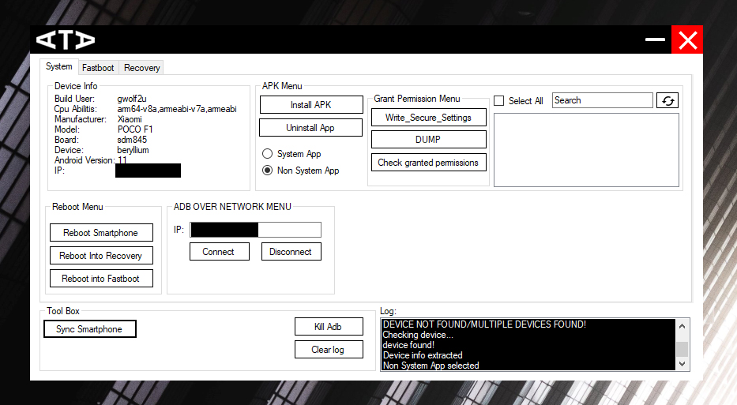

# ATA-GUI

## 💡Introduction
ATA GUI is a project to port ATA to all the users. ATA GUI is an Advance Tool for Android™ powered by SDK Platform Tools. 

> **Last version:**  v1.7.5

## ✨Interface

## ATA License

    Copyright (C) 2021 SwayWasTaken

    Licensed under the Apache License, Version 2.0 (the "License");
    you may not use this file except in compliance with the License.
    You may obtain a copy of the License at

    http://www.apache.org/licenses/LICENSE-2.0

    Unless required by applicable law or agreed to in writing, software
    distributed under the License is distributed on an "AS IS" BASIS,
    WITHOUT WARRANTIES OR CONDITIONS OF ANY KIND, either express or implied.
    See the License for the specific language governing permissions and
    limitations under the License.
    
## ❓What is Scrcpy?

[Scrcpy](https://github.com/Genymobile/scrcpy) was created by the team behind the popular Android emulator Genymotion, but it is not an Android emulator itself, it displays and controls Android devices connected via USB or TCP/IP, it does not require any root access.

Scrcpy works by running a server on your Android device, and the desktop application communicates using USB (or using ADB tunneling wireless). The server streams the H.264 video of the device screen. The client decodes the video frames and displays them. The client captures input (keyboard and mouse) events, sends them to the server, and the server injects them into the device. [The documentation](https://github.com/Genymobile/scrcpy/blob/master/DEVELOP.md) provides more details.

If you want to see your Android screen interact with the app or content on your desktop, record your phone screen or perform other basic tasks, then Scrcpy is a good choice.

In short, Scrcpy is an excellent way to easily view your Android screen on your computer and interact with it in real time.

## Scrcpy License

    Licensed under the Apache License, Version 2.0 (the "License");
    you may not use this file except in compliance with the License.
    You may obtain a copy of the License at

    http://www.apache.org/licenses/LICENSE-2.0

    Unless required by applicable law or agreed to in writing, software
    distributed under the License is distributed on an "AS IS" BASIS,
    WITHOUT WARRANTIES OR CONDITIONS OF ANY KIND, either express or implied.
    See the License for the specific language governing permissions and
    limitations under the License.
          
    Copyright (C) 2018 Genymobile
    Copyright (C) 2018-2021 Romain Vimont

## ❓What is SDK Platform Tools?

[Android™ SDK Platform-Tools](https://developer.android.com/studio/releases/platform-tools.html) is a component for the Android™ SDK. It includes tools that interface with the Android platform, such as adb, fastboot, and systrace. These tools are required for Android app development. They're also needed if you want to unlock your device bootloader and flash it with a new system image.

Although some new features in these tools are available only for recent versions of Android, the tools are backward compatible, so you need only one version of the SDK Platform-Tools.

## SDK Platform Tools License

    Licensed under the Apache License, Version 2.0 (the "License");
    you may not use this file except in compliance with the License.
    You may obtain a copy of the License at

    http://www.apache.org/licenses/LICENSE-2.0

    Unless required by applicable law or agreed to in writing, software
    distributed under the License is distributed on an "AS IS" BASIS,
    WITHOUT WARRANTIES OR CONDITIONS OF ANY KIND, either express or implied.
    See the License for the specific language governing permissions and
    limitations under the License.
    
    Android is a trademark of Google LLC.

    Copyright (C) 2016-2019 Google LLC	https://developer.android.com/license

